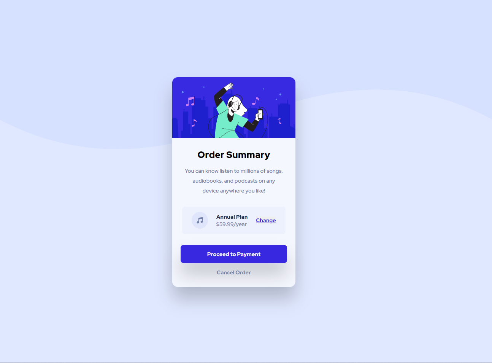

# Frontend Mentor - Order summary card solution

This is a solution to the [Order summary card challenge on Frontend Mentor](https://www.frontendmentor.io/challenges/order-summary-component-QlPmajDUj). Frontend Mentor challenges help you improve your coding skills by building realistic projects. 

## Table of contents

- [Overview](#overview)
  - [The challenge](#the-challenge)
  - [Screenshot](#screenshot)
  - [Links](#links)
- [My process](#my-process)
  - [Built with](#built-with)
  - [What I learned](#what-i-learned)
  - [Continued development](#continued-development)
  - [Useful resources](#useful-resources)
- [Author](#author)
- [Acknowledgments](#acknowledgments)

## Overview

### The challenge

Users should be able to:

- See hover states for interactive elements

### Screenshot

### Links

- Solution URL: [Branch Order summary card](https://github.com/IneMaroc/FrontendMentor-IneMaroc)
- Live Site URL: [Add live site URL here](https://your-live-site-url.com)

## My process

### Built with

- Semantic HTML5 markup
- CSS custom properties
- Sass, Mixin and variables
- Flexbox
- Mobile-first workflow

### Useful resources

- [Emmet cheat Sheet](https://docs.emmet.io/cheat-sheet/) - This helped me writte HTML faster.
- [Sass](https://sass-lang.com/documentation) - Use Sass for well-organize large stylesheets

## Author

- Website - [Ine Maroc](https://github.com/IneMaroc)
- Frontend Mentor - [@IneMaroc](https://www.frontendmentor.io/profile/IneMaroc)
- LinkedIn - [Inés Marocchi](https://www.linkedin.com/in/inesmarocchi/)

